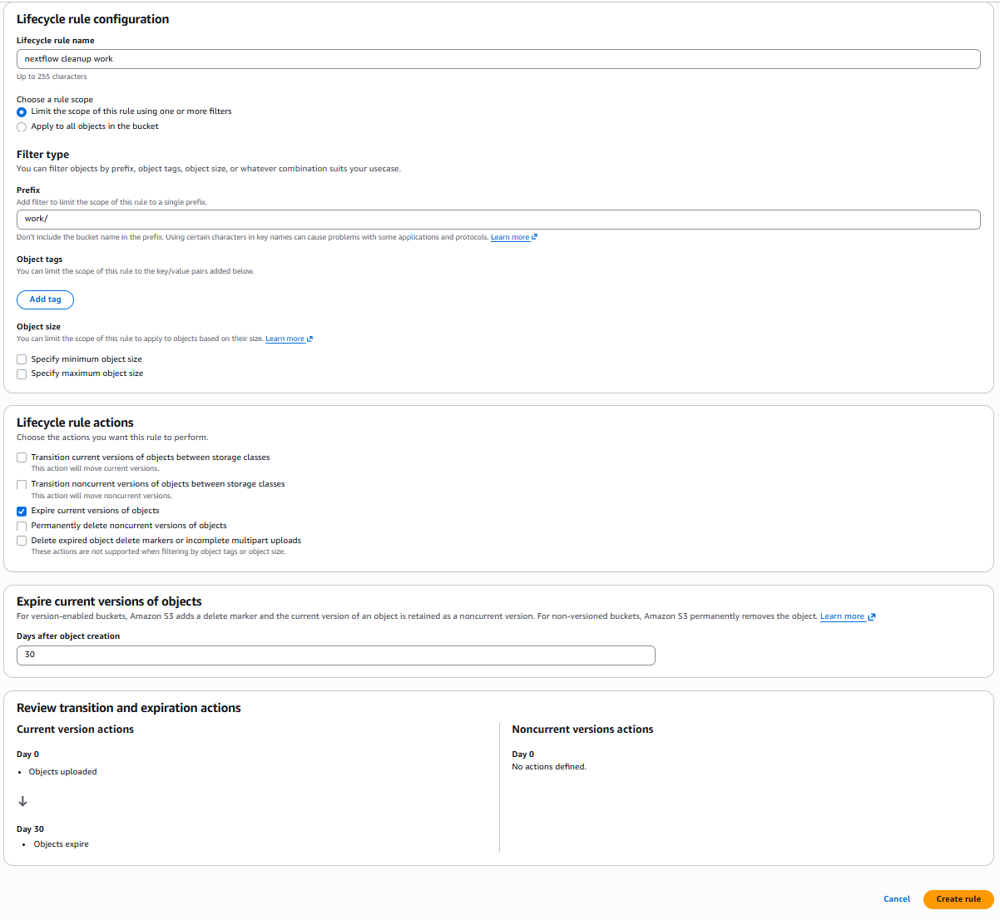
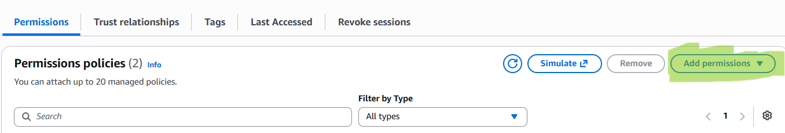
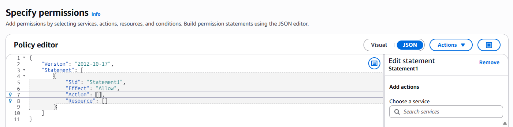
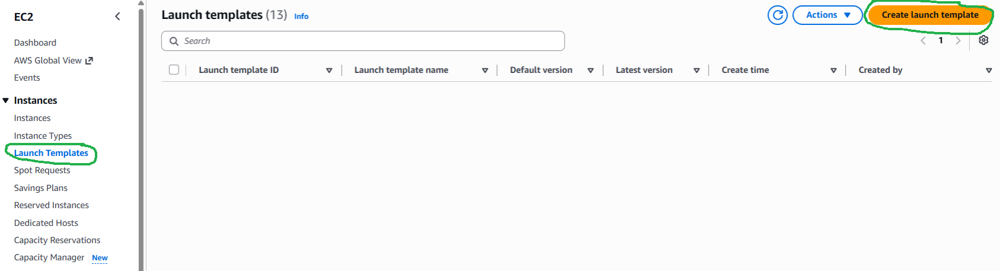
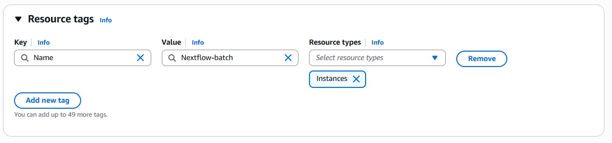
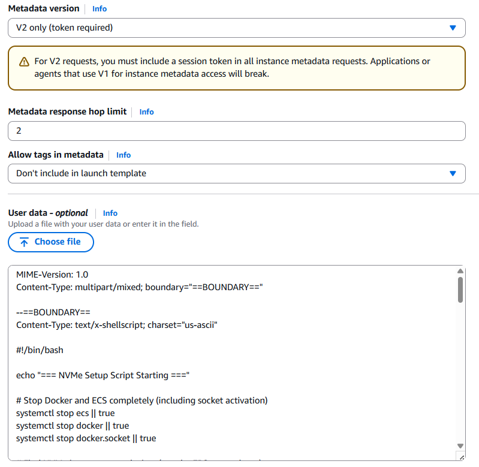
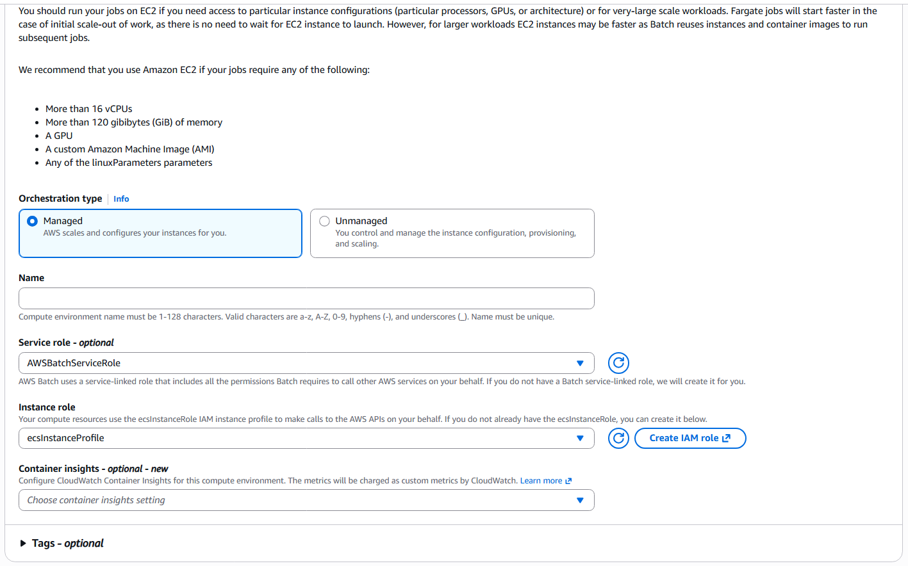
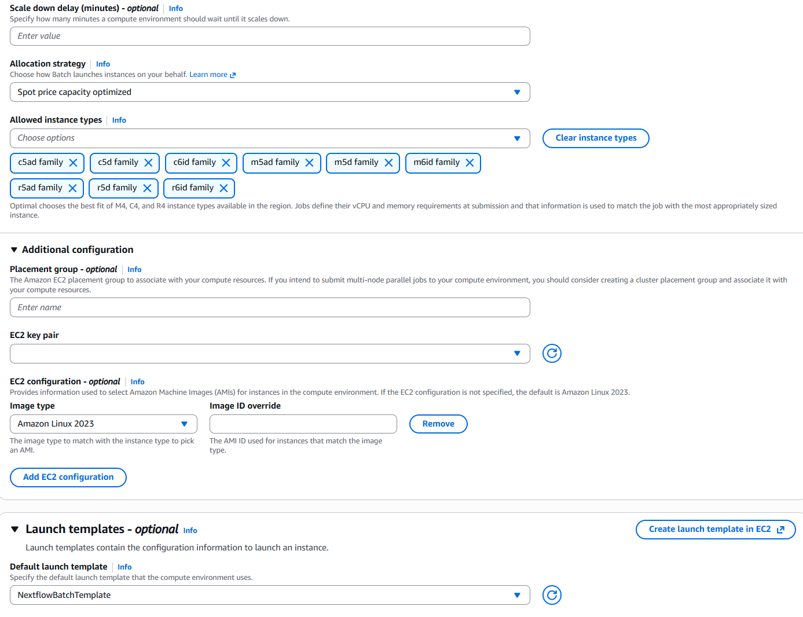
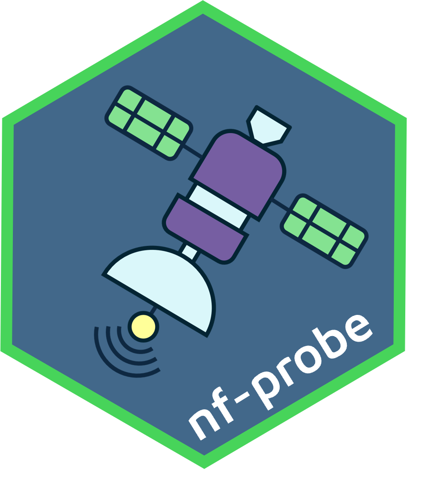

 on Unsplash\~](images/dippyaman-nath-EegncyuEqEI-unsplash.jpg)

It has been a while since my previous Nextflow + AWS Batch guides, and the setup pattern has shifted again.

This post is for folks who want to run open-source Nextflow on AWS Batch without Seqera Platform. [Seqera Platform](https://seqera.io/platform/) is excellent and absolutely worth it if it fits your org and budget. But if you are running solo, in a small R&D team, or just need a lean setup, this is the "no paid platform" path.

On the licensing side, I think most people doing this in smaller teams will find common ground here: the platform is great, but the bill still needs to make sense. If you are an academic institute, startup, or biopharma group with budget and scale, those features can absolutely pay for themselves. For everyone else, a simpler setup may be the better fit.

The good news is that Nextflow remains actively maintained as an open-source project by Seqera, making this approach entirely viable. You can run serious production workloads on AWS Batch without the Seqera platform layer; you'll simply need to take a more hands-on approach during the initial setup and infrastructure configuration.

One notable change since my last write-up is the economics around Fusion. Fusion is now effectively a paid feature beyond the free tier. Well, apparently it was always a paid feature, but let's just say they did not do the best job of making that clear.

So this 2026 setup guide leans into local NVMe scratch on Batch instances instead of Fusion/EBS autoscaling gymnastics.

::: callout-note
There is still a minimal free-tier path for Fusion, but I would say if you are giving it access to your AWS infrastructure and you still want to sleep at night, you probably want MFA for logins, which is not a free-tier feature. That tradeoff was a big part of why I am running plain AWS + open-source Nextflow, and why I wrote this guide.
:::

## What We Are Building

At a high level:

1.  Create an S3 bucket for `workDir` + results.
2.  Create IAM roles for Batch tasks and the Nextflow head node.
3.  Create an EC2 launch template that mounts NVMe as `/scratch` and moves Docker storage there.
4.  Create Batch compute environments and queues (Spot + On-Demand).
5.  Launch a private head node to run Nextflow.
6.  Optionally mount the Nextflow S3 bucket on the head node for debugging in VS Code.
7.  Validate everything with `nf-probe`.

Now historically AWS does not update their console UI too often 🐢, but I have noticed more frequent changes lately, so if some of the button names have changed since I wrote this, you may just need some detective 🕵️ work. The core concepts are still the same, but the UI may have shifted a bit.

## 1) S3 Bucket Setup 🪣

Create a new *private* S3 bucket in the same region as your Batch compute environment.

I recommend:

- A dedicated bucket for Nextflow runs.
- Directories within it called `work/` and `results/`.
- A lifecycle rule to expire old files under `work/` (for example after 30 days).

{width="110%"}

Why lifecycle? Because `work/` can quietly become a cost monster if people forget to clean up old runs. Hoarding data can be a pastime for some of us, but I would say paying increasing S3 bills is not so much fun. So lifecycle rules are a good idea, especially in teams.

::: callout-tip
Bucket versioning is usually disabled by default for new S3 buckets. Keep it that way for this bucket. Versioning can increase storage costs dramatically and is not necessary for temporary work directories.
:::

ℹ️ Write down the ARN of your S3 bucket; you will need it when creating IAM roles and policies.

## 2) IAM Roles 🛡️

#### 2.1 `NextflowTaskRole` (assumed by Batch jobs)

Head over to the IAM console and create a new role for Batch tasks called `NextflowTaskRole`.

Attach:

- Managed policy: `AmazonECSTaskExecutionRolePolicy`
- a custom inline policy

To add a custom inline policy, click on `Add permissons` {width="70%"}

and select `create inline policy` from the drop down.

{width="70%"}

and copy the following JSON policy into the editor.

``` json
{
    "Version": "2012-10-17",
    "Statement": [
        {
            "Sid": "S3WorkDirectory",
            "Effect": "Allow",
            "Action": [
                "s3:GetObject",
                "s3:PutObject",
                "s3:DeleteObject",
                "s3:ListBucket"
            ],
            "Resource": [
                "<NEXTFLOW_WORKDIR_BUCKET_ARN>",
                "<NEXTFLOW_WORKDIR_BUCKET_ARN>/*"
            ]
        },
        {
            "Sid": "S3DataBucketsReadOnly",
            "Effect": "Allow",
            "Action": [
                "s3:GetObject",
                "s3:GetObjectVersion",
                "s3:ListBucket"
            ],
            "Resource": [
                "arn:aws:s3:::*",
                "arn:aws:s3:::*/*"
            ]
        },
        {
            "Sid": "ECRImagePull",
            "Effect": "Allow",
            "Action": [
                "ecr:GetAuthorizationToken",
                "ecr:BatchGetImage",
                "ecr:GetDownloadUrlForLayer"
            ],
            "Resource": "*"
        }
    ]
}
```

::: callout-important
Replace the placeholders `<NEXTFLOW_WORKDIR_BUCKET_ARN>` with the ARN of the S3 bucket you created in step 1.
:::

Why these permissions?

- `S3WorkDirectory` gives jobs write/delete access only to the designated Nextflow work/results bucket.
- `S3DataBucketsReadOnly` lets tasks read input data broadly without giving them write access to raw/project data buckets.
- `ECRImagePull` allows jobs to pull container images at runtime.

The intent is least privilege with practical usability: write and delete where you must (S3 work dir), read where you need (e.g. input data/project buckets), and avoid broad destructive access.

#### 2.2 `NextflowHeadNodeRole` (assumed by the EC2 head node)

Create another role for your head node instance profile and attach an inline policy like this:

``` json
{
    "Version": "2012-10-17",
    "Statement": [
        {
            "Sid": "BatchJobOrchestration",
            "Effect": "Allow",
            "Action": [
                "batch:CancelJob",
                "batch:RegisterJobDefinition",
                "batch:DescribeJobDefinitions",
                "batch:DescribeJobQueues",
                "batch:DescribeComputeEnvironments",
                "batch:ListJobs",
                "batch:DescribeJobs",
                "batch:SubmitJob",
                "batch:TerminateJob",
                "batch:TagResource"
            ],
            "Resource": "*"
        },
        {
            "Sid": "PassRoleToJobs",
            "Effect": "Allow",
            "Action": "iam:PassRole",
            "Resource": "<NextflowTaskRole_ARN>"
        },
        {
            "Sid": "S3WorkDirectory",
            "Effect": "Allow",
            "Action": [
                "s3:GetObject",
                "s3:PutObject",
                "s3:DeleteObject",
                "s3:ListBucket",
                "s3:ListBucketVersions"
            ],
            "Resource": [
                "<NEXTFLOW_WORKDIR_BUCKET_ARN>",
                "<NEXTFLOW_WORKDIR_BUCKET_ARN>/*"
            ]
        },
        {
            "Sid": "ReadOnlyAllS3",
            "Effect": "Allow",
            "Action": [
                "s3:Get*",
                "s3:List*"
            ],
            "Resource": "*"
        },
        {
            "Sid": "EC2LaunchTemplates",
            "Effect": "Allow",
            "Action": [
                "ec2:DescribeLaunchTemplates",
                "ec2:DescribeLaunchTemplateVersions",
                "ec2:DescribeInstanceAttribute",
                "ec2:DescribeInstances",
                "ec2:DescribeInstanceStatus",
                "ec2:DescribeInstanceTypes",
                "ecs:DescribeContainerInstances",
                "ecs:DescribeTasks"
            ],
            "Resource": "*"
        }
    ]
}
```

This role is your control plane role for orchestration:

- `BatchJobOrchestration` lets the head node register, submit, monitor, tag, and terminate jobs.
- `PassRoleToJobs` is required so submitted jobs can assume `NextflowTaskRole`.
- `S3WorkDirectory` supports read/write/delete in the dedicated work bucket.
- `ReadOnlyAllS3` allows broad read/list across S3 for upstream input access patterns.
- `EC2LaunchTemplates` also includes the EC2/ECS describe actions Nextflow commonly uses when orchestrating Batch jobs.

So the split is deliberate: the head node can coordinate everything, while destructive data access stays constrained to your dedicated Nextflow bucket.

::: callout-important
Replace placeholders:
- `<NextflowTaskRole_ARN>` with the ARN of the IAM role you created in step 2.1. (e.g. `arn:aws:iam::<account-id>:role/NextflowTaskRole`)
- `<NEXTFLOW_WORKDIR_BUCKET_ARN>` with the ARN of the S3 bucket you created in step 1.
:::

::: callout-note
If you connect to your head node via AWS Systems Manager Session Manager, i.e. SSO, also attach `AmazonSSMManagedInstanceCore` to the head node role.
:::

## 3) Launch Template for Batch Compute 🚀

Ok this is probably the biggest update compared to my previous guides. We are going to use launch templates to automate all the NVMe scratch setup and Docker storage relocation. What this gives us is Batch compute instances that have local NVMe drives included with their compute (very cost effective), mounted as `/scratch` for temporary storage. We will also move Docker storage to that NVMe scratch so container pulls and writes are fast and do not hit EBS. This is the middle ground I have found between the old EBS autoscaling gymnastics and the new Fusion paid feature.

#### Why NVMe scratch instead of Fusion or EBS autoscaling?

This is the core concept behind the setup, so it is worth spelling out clearly:

- Nextflow still uses S3 as the durable source of truth for `workDir` and outputs.
- Each Batch task stages what it needs onto fast local disk (`/scratch` on NVMe).
- The task runs on local disk (fast reads/writes, good random I/O, no EBS scaling logic).
- Results and task metadata are pushed back to S3 when tasks complete.

Alright lets give it a crack.

Head over to EC2 in the AWS console and create a new launch template.

{width="100%"}

Lets call it `NextflowBatchTemplate`. You can call it what you like, `dancing-pot-plant` if you like, just take note of what you name it as you will need it later when creating your Batch compute environments.

Leave all the settings blank or default, including the AMI. In the Batch compute environment we will specify the use of Amazon Linux 2023 ECS-optimised AMI.

Network settings and Storage volumes, leave blank, we will just use the default root volume that comes with the AMI, as we are going to mount the NVMe instance store as `/scratch` and move Docker storage there.

Under resource tags, this is a good place to add a tag like `Name: Nextflow-Batch` so you can easily identify the instances in the EC2 console. That way you can easily see which instances belong to your Nextflow Batch setup, if you need to manually terminate them.

{width="100%"}

Add in the following metadata options: - `V2 only (token required)` - hop limit `2`

You should be able to leave everything else blank as this is a launch template. Then paste this in the User Data section:

``` bash
MIME-Version: 1.0
Content-Type: multipart/mixed; boundary="==BOUNDARY=="

--==BOUNDARY==
Content-Type: text/x-shellscript; charset="us-ascii"

#!/bin/bash

echo "=== NVMe Setup Script Starting ==="

# Stop Docker and ECS completely (including socket activation)
systemctl stop ecs || true
systemctl stop docker || true
systemctl stop docker.socket || true

# Find NVMe instance store devices (not the EBS root volume)
ROOT_DEVICE=$(lsblk -rno PKNAME "$(findmnt -n -o SOURCE /)" | head -1)
echo "Root device: $ROOT_DEVICE"

INSTANCE_DEVICES=""
for dev in /dev/nvme*n1; do
    DEV_NAME=$(basename "$dev")
    if [ "$DEV_NAME" = "$ROOT_DEVICE" ]; then
        continue
    fi
    if lsblk -rno MOUNTPOINT "$dev" 2>/dev/null | grep -q .; then
        continue
    fi
    INSTANCE_DEVICES="$INSTANCE_DEVICES $dev"
done

INSTANCE_DEVICES=$(echo $INSTANCE_DEVICES | xargs)

if [ -z "$INSTANCE_DEVICES" ]; then
    echo "No NVMe instance storage found — using EBS only"
    systemctl start docker
    systemctl start ecs
    echo "=== NVMe Setup Complete (EBS only) ==="
    exit 0
fi

echo "Found NVMe instance store: $INSTANCE_DEVICES"

MOUNT_POINT="/scratch"
mkdir -p $MOUNT_POINT

DEVICE_COUNT=$(echo $INSTANCE_DEVICES | wc -w)

if [ "$DEVICE_COUNT" -gt 1 ]; then
    yum install -y mdadm 2>/dev/null || true
    mdadm --create /dev/md0 --level=0 --raid-devices=$DEVICE_COUNT $INSTANCE_DEVICES --force
    mkfs.xfs /dev/md0
    mount /dev/md0 $MOUNT_POINT
else
    mkfs.xfs -f $INSTANCE_DEVICES
    mount $INSTANCE_DEVICES $MOUNT_POINT
fi

chmod 1777 $MOUNT_POINT
echo "NVMe mounted at $MOUNT_POINT"
df -h $MOUNT_POINT

# Move Docker storage to NVMe
mkdir -p $MOUNT_POINT/docker
cat <<EOF > /etc/docker/daemon.json
{
    "data-root": "/scratch/docker"
}
EOF
echo "Docker data-root configured"

# Ensure required tools are present
yum install -y curl tar gzip xz unzip || true

# Install AWS CLI via Seqera miniconda bundle (isolated path)
curl -fsSL https://nf-xpack.seqera.io/miniconda-awscli/miniconda-25.3.1-awscli-1.40.12.tar.gz \
  | tar xz -C /

# Validate binary exists at the path Nextflow will use
if [ ! -x /home/ec2-user/miniconda/bin/aws ]; then
  echo "ERROR: aws binary not found at /home/ec2-user/miniconda/bin/aws"
  exit 1
fi

/home/ec2-user/miniconda/bin/aws --version

# Restart Docker and ECS
systemctl start docker
systemctl enable --now --no-block ecs

# Kernel settings to reduce dirty-page bursts
echo "1258291200" > /proc/sys/vm/dirty_bytes
echo "629145600" > /proc/sys/vm/dirty_background_bytes

echo "=== NVMe Setup Complete ==="

--==BOUNDARY==--
```

{width="70%"}

The user data script is going to do all the fancy trickery 🔮 of finding NVMe instance storage, mounting it as `/scratch`, moving Docker storage there, and installing the AWS CLI in a location that Nextflow will find it.

::: callout-note
Leave instance type in the launch template blank as Batch overrides it. The compute environment will specify the instance types that have NVMe instance storage. The launch template is just for the user data and other settings.
:::

## 4) Batch Compute Environments and Queues 🧮

Head over to the Batch console where we are going to create two new compute environments. I recommend:

- `spot` (primary, cheaper - this should be your default queue in Nextflow config)
- `ondemand` (for those longer running jobs where it doesn't make financial sense to use Spot, and have them potentially terminated and restarted after potentially 12 hours of compute)

We want these to be Amazon EC2 managed queues. Select the service role and instance role. Note if you have not created these roles before, Batch will offer to create them for you.

{width="70%"}

For the spot queue make sure you toggle on the 'Use EC2 Spot Instances' option. For the ondemand queue, leave this off.

For the instance configuration page I recommend the following starting points:

- Keep `min vCPU = 0`.
- Keep `desired vCPU = 0`.
- Start with a conservative `max vCPU`. (e.g. 400)

::: callout-note
Why conservative max vCPU? Because parallel mistakes are expensive mistakes 💸 A buggy pipeline or a sample-sheet typo, at 10000 vCPUs is a memorable life event.
:::

Allocation strategy: 'Spot price capacity optimized' for the spot queue, and 'best fit' for the ondemand queue.

Under allowed instance types, this is where we want to restrict it to only those that come with NVMe instance storage included. Such as c5ad family, c5d family, c6id family, m5ad family, m5d family, m6id family, r5ad family, r5d family and r6id family.

Under additional configuration make sure you choose Amazon Linux 2023 as the Image type (leave image ID override blank).

Then under Launch templates, select the launch template you created in the previous step.

{width="70%"}

Click next through to the network configuration page. Select the VPC and private subnets that you want to use for your Batch compute environments.

Now we need to create two new job queues, one for spot and one for ondemand.

Head over to Job queues under AWS Batch and create a new EC2 queue for each compute environment. Nothing too fancy here in terms of settings, just give them a name and select the compute environment you created in the previous step.

You can choose to get fancy 🎩 later with priority, but for now just keep it simple.

## 5) Nextflow Head Node 🎛️

Now we need an on-demand EC2 instance to run Nextflow itself. This is your head node / launchpad for orchestrating Batch jobs, or Yavin 4 😉

Head over to EC2 in the AWS console and launch a new instance. I recommend:

- A Linux AMI (I use Ubuntu, but run your own race, there a jungle of flavours out there)
- Private subnet.
- Attach the `NextflowHeadNodeRole` instance profile.
- Small-to-medium instance type (e.g. t3.2xlarge) to start. Avoid anything too small because Nextflow can be memory hungry with large pipelines.
- 

Follow the [latest guide](https://docs.seqera.io/nextflow/install) from Seqera for installing Nextflow on your head node:

::: callout-note
If you do not use SSO/SSM, I would suggest you put the head node behind a bastion/jump host and keep direct internet exposure to a minimum.
:::

## 6) Nextflow Config

Use a profile similar to this or adjust to fit your config layouts:

``` groovy
profiles {
    awsbatch {
        process.executor = 'awsbatch'
        process.queue = 'spot'

        aws.region = 'ap-southeast-2'
        aws.batch.cliPath = '/home/ec2-user/miniconda/bin/aws'
        aws.batch.maxSpotAttempts = 3

        workDir = 's3://NEXTFLOW_WORKDIR_BUCKET_ARN/work/'
        params.outdir = 's3://NEXTFLOW_WORKDIR_BUCKET_ARN/results/'
    }
}
```

::: callout-tip
Make sure you add `aws.batch.maxSpotAttempts = 3` so that your nextflow will resubmit failed spot jobs automatically. You can adjust this number based on your tolerance for spot interruptions.
:::

You can override `process.queue` per process if you want specific jobs to hit `ondemand`. For example:

``` groovy
process {
    withName: 'LONG_JOB' {
        queue = 'ondemand'
        container = 'community.wave.seqera.io/library/bcftools:1.21--4335bec1d7b44d11'
        cpus = 2
        memory = 16.GB
    }
}
```

## 7) Optional: Mount the Nextflow bucket on the head node (for debugging in VS Code)

This part is optional, but honestly very useful when you are troubleshooting weird task behaviour.

The idea is to mount your Nextflow S3 bucket on the head node using Mountpoint for Amazon S3, so in VS Code you can browse the `work/` and `results/` paths like a normal directory tree.

It is not as polished as the data browsing experience in Seqera Platform, but as a practical compromise for this DIY setup, it works well 👍

Follow the official Mountpoint for Amazon S3 install instructions for your distro:

- https://docs.aws.amazon.com/AmazonS3/latest/userguide/mountpoint-usage.html

Once installed on the head node, the way to mount the nextflow bucket is:

``` bash
mount-s3 <s3://YOUR_NEXTFLOW_BUCKET> ~/s3-nextflow
```

Now it shows up in your file explorer panel in VS Code, and you can browse the `work/` and `results/` directories like a normal filesystem and inspect files.

If you want this mount to persist across reboots, set it up as a systemd service on the head node after you validate the manual mount.

## 8) Test with nf-probe

Time to test the whole stack before launching your actual pipeline 📋

{width="40%"}

I've developed a simple Nextflow pipeline called [nf-probe](https://github.com/lpembleton/nf-probe) for this exact purpose, of testing and validating new AWS Batch setups.

``` bash
git clone https://github.com/lpembleton/nf-probe.git
cd nf-probe

# Edit params JSON with your region, queue, and S3 paths
nextflow run main.nf -profile awsbatch -params-file params.json
```

What you are validating with this test:

- Batch submission works.
- Containers pull correctly.
- Read/write to S3 works.
- NVMe scratch is mounted and usable.

## Additional Notes

- Batch startup is not instant. A few minutes of queuing is normal.
- Spot queues are cheaper but can delay or interrupt jobs.
- Start small, validate, then scale out, no one likes an expensive hero.

## Final Thought

If you can afford Seqera Platform, it will make your life easier. If you cannot, this setup is a solid way to run serious Nextflow workloads on AWS in 2026 without selling your last kidney (AWS already has your first 😉).